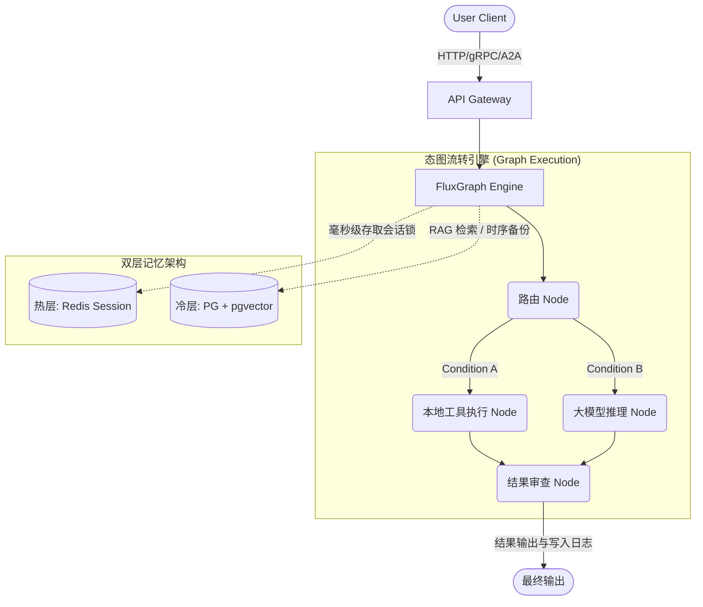

# FluxGraph：构建高并发的 Golang AI 智能体微生态


在开源大模型应用开发生态里，LangGraph 发明了一套绝妙的理论：基于图计算与状态机的 Node 编排，能极大解决 LLM 长线执行中幻觉和方向丢失的问题。但当我们试图把 AI 推向**微服务与海量并发请求**的工业级生产线时，Python 框架往往带来了锁瓶颈。

出于这种刚需，我开发了 **FluxGraph**：一个生产级、高并发的 Golang AI 智能体（Agent）开发框架。

GitHub 仓库地址：[BaBiQ888/fluxgraph](https://github.com/BaBiQ888/fluxgraph)

## 📖 架构定调：微型操作系统

FluxGraph 不仅仅是一个通过并发调用 LLM API 的库。它充当着类似于容器平台的“操作系统层”。当你在构建基于 FluxGraph 的 Agent 时，你是在编排一个状态图（Graph），把复杂的业务流拆解为独立的 `Nodes` 和 `Edges` 行走路径。

它将所有状态（State）抽象为线程安全的、可以纯函数流控的上下文，从而能够无缝支撑 Golang goroutine 的洪荒之力并发。

## 💡 核心工业级特性

在 FluxGraph 的设计理念中，我主要攻克了当前主流框架的四个痛点：

### 1. A2A (Agent-to-Agent) 原生微服务通信
独立单机的 AI 终有尽头，蜂群思维（Swarm）才是答案。
内置原生的 `a2a` 包打通了 gRPC/HTTP 服务，你只需简单地启动服务，就能把一个运行起来的 FluxGraph 引擎挂载成为 K8s 环境下能够跨语言调用的标准微服务接口，实现智能体去调用其它智能体业务模块的通讯机制。

### 2. 双级可回溯记忆栈 (Dual-Tier Memory System)
长期的记忆遗忘和超长 Token 引发降智是开发大模型的一贯难题。框架内部抽离了记忆层，提供极具分层思想的记忆引擎：
- **热层 (Redis)**：主要承担几毫秒内发生的多轮对话拦截、会话状态流转或分布式限流。
- **冷层 (PostgreSQL + pgvector)**：用于基于向量内积（Vector Search）存储 Agent 处理过的海量历史语料。通过内嵌的 RAG 检索引擎自动获取和找回历史执行经验。



### 3. 全局可观测性保障
Agent 框架如果不带链路追踪，调试就会变成一个盲盒灾难：
框架底层全面继承了 OpenTelemetry (OTel)。所有图节点的数据进出流，以及向 OpenAI 等上游接口发起调用的 Request/Response 信息全量打入 Prometheus + Jaeger 监控栈。你可以在 Jaeger 后台中如剖析传统微服务一样看到 LLM 调用的每一段耗时（Spans）。

### 4. 高危熔断与守卫 (GuardHooks)
我们不能让模型自行决定运行某些非常高危的命令：
加入了执行前的 `GuardHooks`，它会对 LLM 回应的解析结果执行验证，甚至可以设计为针对高危 Tool Calls（如服务器格式化操作等）拉起上报机制。

## ⚙️ 代码概览（Go 代码的极致封装与优雅）

定义一个业务节点非常符合 Go 开发者的直觉：

```go
package main

import (
	"context"
	"github.com/BaBiQ888/fluxgraph/core"
	"github.com/BaBiQ888/fluxgraph/engine"
	"github.com/BaBiQ888/fluxgraph/graph"
	"github.com/BaBiQ888/fluxgraph/interfaces"
)

// 声明节点类型
type MyBusinessNode struct {
	id string
}
func (n *MyBusinessNode) ID() string { return n.id }
func (n *MyBusinessNode) Process(ctx context.Context, state *core.AgentState) (*interfaces.NodeResult, error) {
	// 在此注入你的业务代码及大模型调用，然后挂载进状态树 ... 
	state = state.WithMessage(core.Message{
		Role: core.RoleAssistant,
		Parts: []core.Part{{Type: core.PartTypeText, Text: "任务处理成功！"}},
	})
	return &interfaces.NodeResult{State: state}, nil
}

func main() {
    g := graph.NewGraph()
    g.AddNode(&MyBusinessNode{id: "step_one"}) // 拼装节点图
    g.SetEntrypoint("step_one")

    fluxEngine := engine.NewEngine(g) // 装载进图执行引擎
    _, err := fluxEngine.Run(context.Background(), core.NewAgentState())
}
```

## 结语

使用 Go 拥抱大模型赛道正是最佳的风口时机。FluxGraph 的目标是给开发者提供强力骨架，让每一滴 CPU 资源都专注地用在模型的高效编排和复杂业务调度上。

由于项目高度工程化且内含许多架构思想，强烈建议阅读 [这套源码](https://github.com/BaBiQ888/fluxgraph)，我也随时欢迎有志于 Gopher + AI 的朋友来提交 PR 共同构建。
