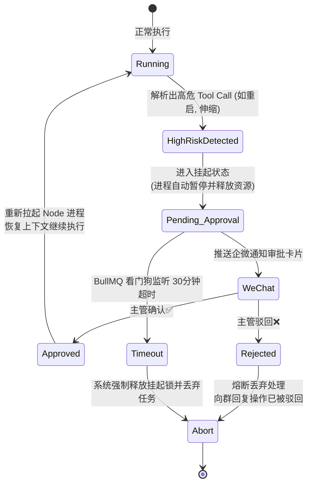

# OmniOps Agent：企业级多模态自动化运维机器人

在如今这种高并发且动辄告警风暴的微服务环境中，将一切排障动作委派给 AI 已经是一种不可逆的趋势。为此，我设计了 **OmniOps Agent**，一款专为生产环境与复杂现网护航的**企业级多模态自动化运维智能体**。

GitHub 原创仓库地址：[BaBiQ888/OmniOps-Agent](https://github.com/BaBiQ888/OmniOps-Agent)

## 💡 我们为什么需要它？

运维机器人的概念早就存在，有很多企业使用类似 LangChain 的黑盒方案搭建机器人，结果一旦遇到故障，大模型在复杂的上下文里会犯迷糊，一旦发生“误删库”、“乱杀容器”的高危指令便不可收拾。

OmniOps Agent **彻底抛弃了 LangChain**，这是一款完全由纯粹的 Node.js 异步状态机手工打磨的原生 `ReAct` 流水线中枢。

## 🤖 核心能力：多模态的深度洞察

日常运维早已不再局限于文本敲击的终端命令中：
- **图片降维理解**: 如果业务研发群甩了一张 Grafana 折线波动告警图，Agent 将自动调用底层的视觉模型 (Qwen-VL-Max)。系统能在几秒内对长图抽离出 `trace_id` 与错误等级 JSON，随后再以轻量化的纯文字信息投喂给核心思考大模型。这规避了将超长二进制图灌入带来的 Token 成本，防低智。
- **语音排障转录**: 紧急视频会议时，随口发出来的“服务器白屏了”，依靠挂载的 Whisper ASR 将自动实时解析并翻译成 Agent 指令。

## 🛡️ 工业防御：人类在回路（HITL）

这个 Agent 从诞生之初，就在“自主化”和“安全审计”之间找到了最不可逾越的一条底线——没有您的同意它绝不可能干出高危的破坏指令。我们设计了**高危零信任拦截体系**（Human In The Loop）：

当 Agent 在图节点中意图下发譬如 `delete_cache` 或在 K8s 中 `restart_pod`、`scale_up` 这些 Tool Call 时：
1. **立即熔断并强行挂起（Pending_Approval）**: 底层状态机将中断 LLM 的轮询。
2. **真无服务架构回收**: 对外的 Node 进程甚至会自动关闭清空宿主内存！不浪费资源枯等用户！
3. **企微交互拦截卡片**: 给主管的手机推送企业微信消息，显示它的全盘思考依据与想要调用的具体 `Payload` 和 `Action` 命令。
4. **异步唤醒/死信防暴**: 当主管点击企微同意后，进程依靠 Webhook 带着状态凭据继续执行工作。如果长达半小时没有人同意，系统内的 BullMQ 看门狗机制将会判定“审批超时废弃”，Agent 则体面退群并自动流转记录到后台中。

## 🚦 并发下的极客特性

在多群运维中，研发极有可能一秒发五条内容，“合并防痘”在群消息流转中极为重要：
1. **内容查重墙**: 进站前做了文本指纹比对机制和 userID 锁。
2. **版本控制乐观锁**: 它在处理上抛弃了易丢数据的内存存储，在底层引入了 PostgreSQL `omni_sessions` 设计了携带 `version` 的乐观锁机制，直接物理层防止并发事务。

## 🕸️ 拓展版图：MCP (Model Context Protocol) 联邦

在下发动作方面，基于最新的 [MCP 模型上下文协议](https://modelcontextprotocol.io/) 它变成了一个标准的“大脑插座”：
- `query_logs`: 穿透 ELK 分析报错栈。
- K8S 管理: 集成并安全下发指令到 Kubernetes。
- `create_jira_ticket`: 分析不出？自主建立规范的 Jira 漏洞工单拉群让核心研发闭环。

如果您对如何在企业内落地真金白银不敢乱试的 AI 安全底座，欢迎参考并[加注一颗 Star ✨](https://github.com/BaBiQ888/OmniOps-Agent)！
